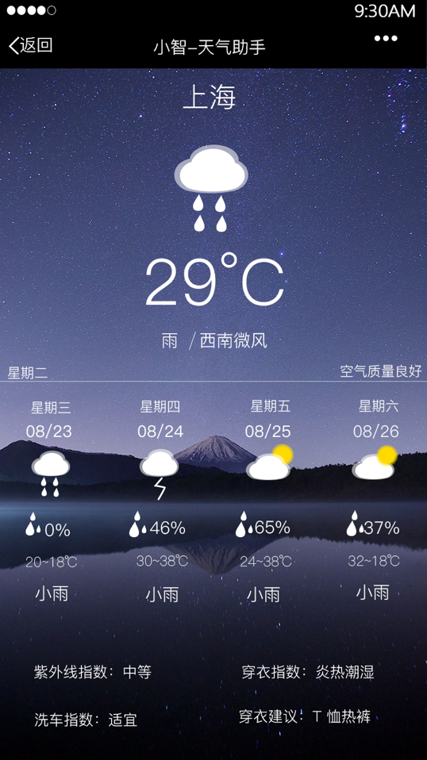
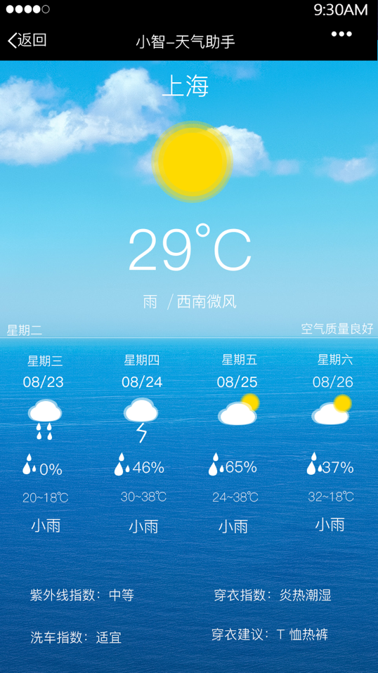
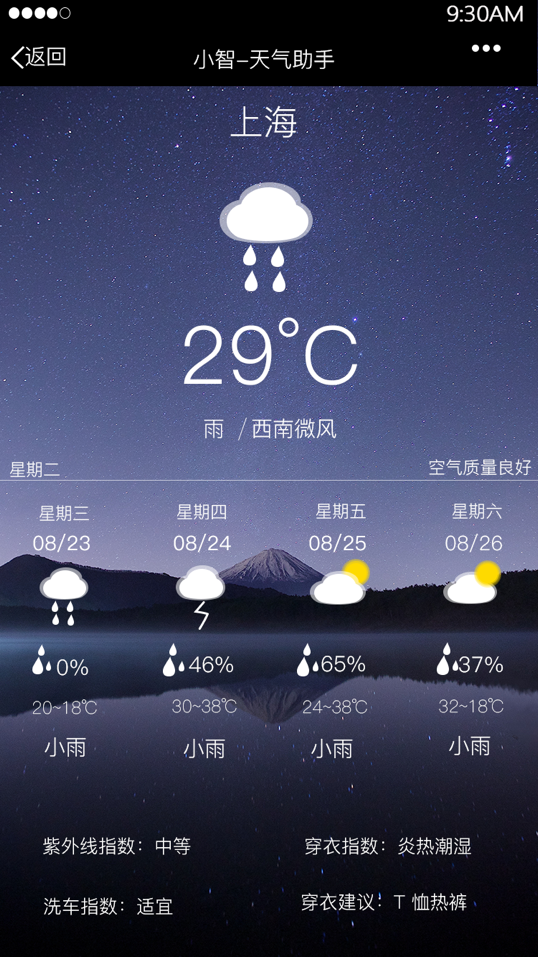
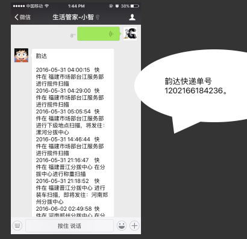
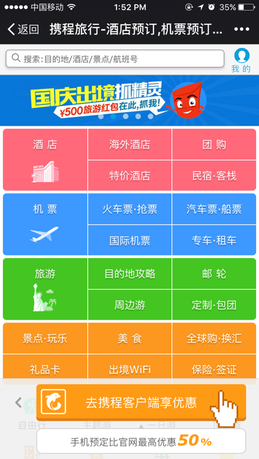
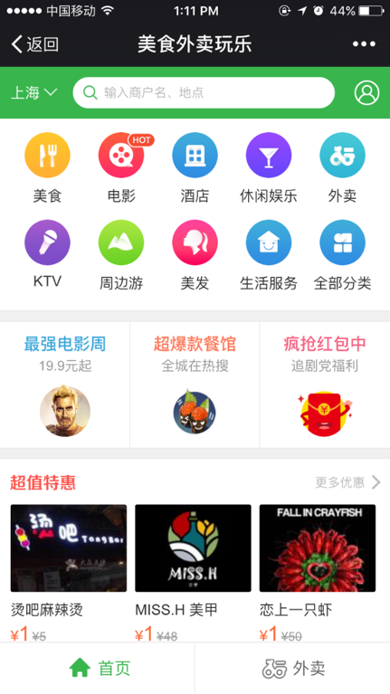
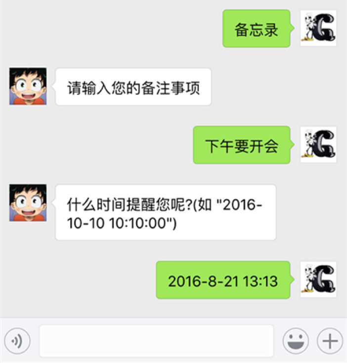

# 微信智能生活管家 - 小智
> 微信智能机器人 Python

## 更新
> 2016/08/23  Version 1.0
>
## 简介
> 微信智能生活管家——小智,为您提供天气,快递,衣食住行,备忘录查询功能.您可以输入"天气","快递+单号","吃饭”,“提醒”等关键词进行查询哟!

## 分类
> 微信后台机器人

## 截图

### ICON

### 天气查询

支持热门城市天气查询: 温度、湿度、风向、风力、穿衣、感冒、洗车、运动和紫外线指数

### 快递查询

支持顺丰,四通一达,德邦,EMS,天天,全峰等快递查询

### 衣食住行查询

购买服饰,查询酒店,饭店,打车

### 备忘功能

日程提醒功能:如会议,约会,吃药等

